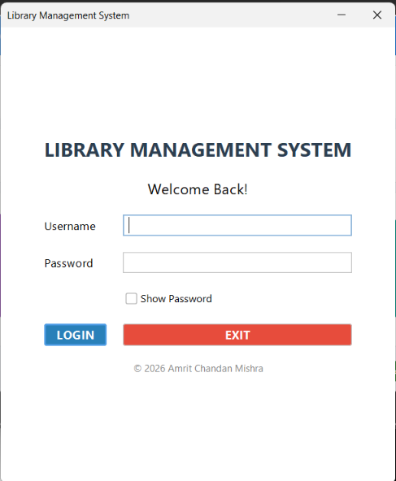
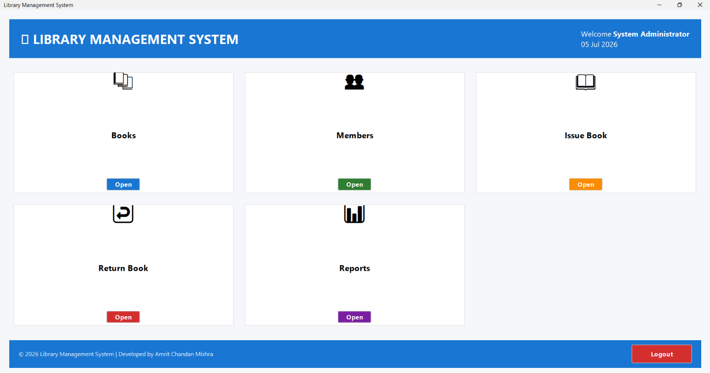
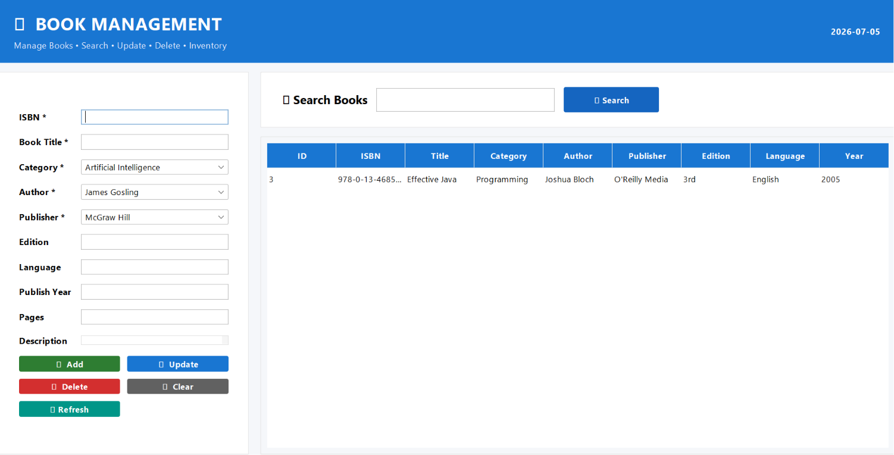
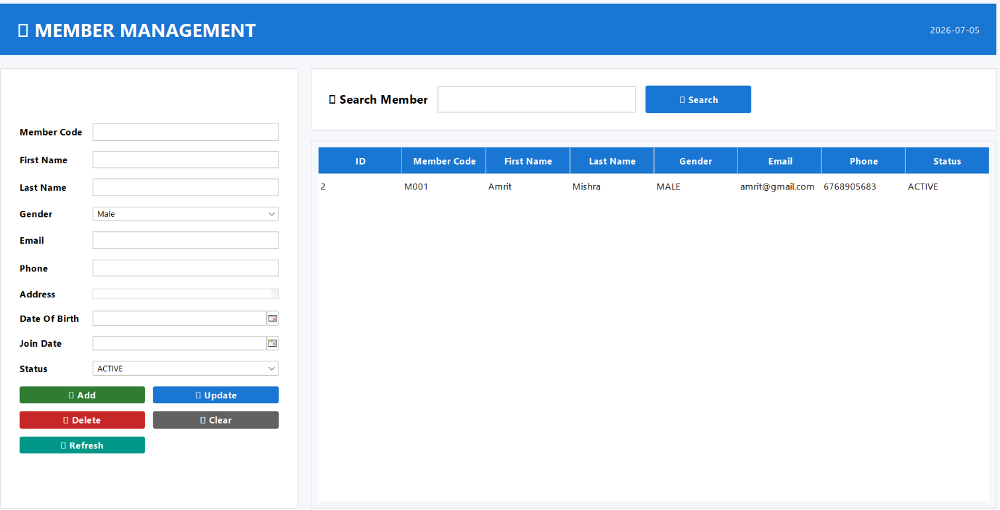
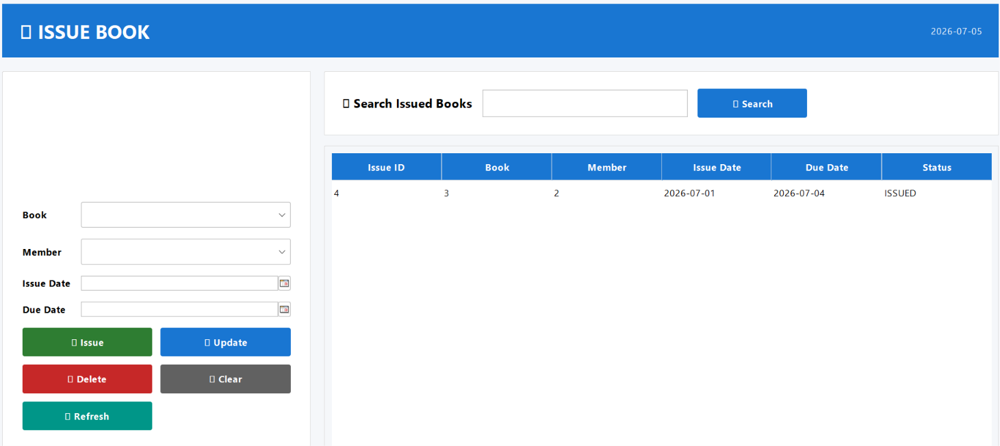
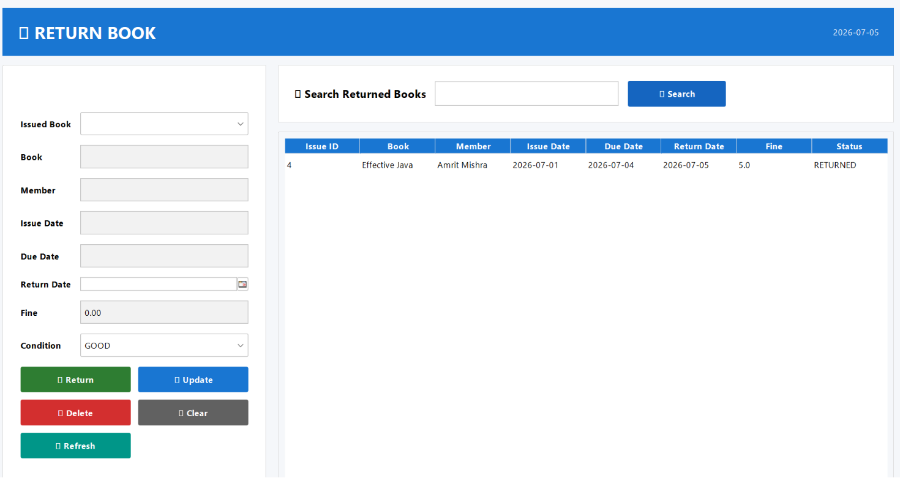
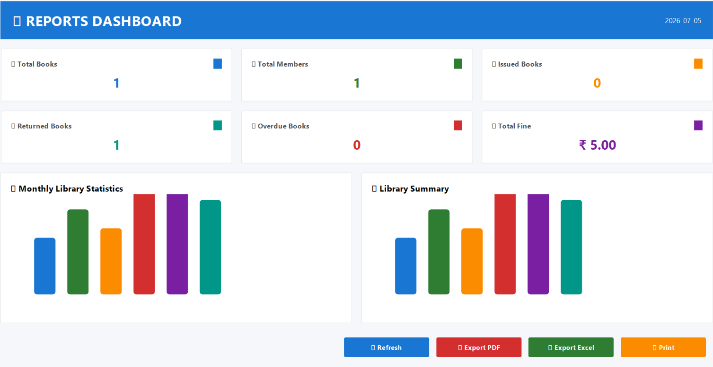

# 📚 Library Management System


A professional desktop-based **Library Management System** developed using **Core Java, Java Swing, JDBC, and MySQL**. The application provides a complete solution for managing books, members, authors, publishers, categories, book issue/return operations, reporting, and fine management.

---

# 📖 Project Overview

The Library Management System is designed to automate and simplify the daily operations of a library.

It enables librarians to:

- Manage books
- Manage library members
- Issue books
- Return books
- Track due dates
- Calculate fines
- Generate reports
- Maintain library records efficiently

The application follows a layered architecture using DAO and Service patterns for better maintainability and scalability.

---

# ✨ Features

## Authentication

- Secure Login
- Session Management

---

## Dashboard

- Library Overview
- Quick Navigation
- Statistics Cards

---

## Book Management

- Add Book
- Update Book
- Delete Book
- Search Book
- Book Inventory

---

## Category Management

- Add Category
- Update Category
- Delete Category
- Search Category

---

## Author Management

- Add Author
- Update Author
- Delete Author
- Search Author

---

## Publisher Management

- Add Publisher
- Update Publisher
- Delete Publisher
- Search Publisher

---

## Member Management

- Register Member
- Update Member
- Delete Member
- Search Member

---

## Book Issue

- Issue Books
- Select Member
- Due Date Management
- Prevent Duplicate Issues

---

## Return Book

- Return Books
- Fine Calculation
- Update Book Status
- Return History

---

## Reports Dashboard

- Total Books
- Total Members
- Issued Books
- Returned Books
- Overdue Books
- Total Fine Collection

---

## Fine Management

- View Fine Records
- Update Fine
- Search Fine
- Payment Tracking

---

# 🛠 Technology Stack

| Technology | Version |
|------------|----------|
| Java | 21 |
| Swing | Java Swing |
| JDBC | Latest |
| Database | MySQL |
| IDE | IntelliJ IDEA |
| Build Tool | IntelliJ Project |

---

# 🏗 Project Architecture

```
Presentation Layer
        │
        ▼
Service Layer
        │
        ▼
DAO Layer
        │
        ▼
Database (MySQL)
```

---

# 📂 Project Structure

```
LibraryManagementSystem
│
├── src
│   ├── common
│   ├── config
│   ├── dao
│   ├── entity
│   ├── mapper
│   ├── repository
│   ├── service
│   ├── ui
│   ├── util
│   └── validator
│
├── database
│
├── screenshots
│
├── docs
│
└── README.md
```

---

# 🗄 Database Tables

- users
- books
- authors
- categories
- publishers
- members
- book_issues

---

# 📸 Screenshots

# 📸 Screenshots

## Login



---

## Dashboard



---

## Book Management



---


## Member Management



---

## Issue Book



---

## Return Book



---

## Reports Dashboard



---


# 🚀 Installation

## Clone Repository

```bash
git clone https://github.com/ac-mishra/Library-Management-System-App.git
```

---

## Configure Database

Create a MySQL database.

```
library_db
```

Import the SQL file.

---

## Configure Database Connection

Update:

```
DBConnection.java
```

```java
private static final String URL="jdbc:mysql://localhost:3306/library_management";
private static final String USER="root";
private static final String PASSWORD="your_password";
```

---

## Run Project

Open using IntelliJ IDEA.

Run:

```
LoginFrame.java
```

---

# 🔍 Validation

- Required Field Validation
- Duplicate Entry Prevention
- Database Constraints
- Input Validation
- Exception Handling

---

# 📈 Future Enhancements

- Barcode Scanner
- QR Code Support
- Email Notifications
- PDF Export
- Excel Export
- Book Reservation
- User Roles
- Dark Theme
- Cloud Database Support

---

# 👨‍💻 Author

**Amrit Chandan Mishra**

Java Developer

GitHub

https://github.com/ac-mishra

---

# 📄 License

This project is developed for educational and portfolio purposes.

---

# ⭐ Support

If you found this project helpful, consider giving it a ⭐ on GitHub.

---

## Thank You

Thank you for visiting this project.

Happy Coding! 🚀